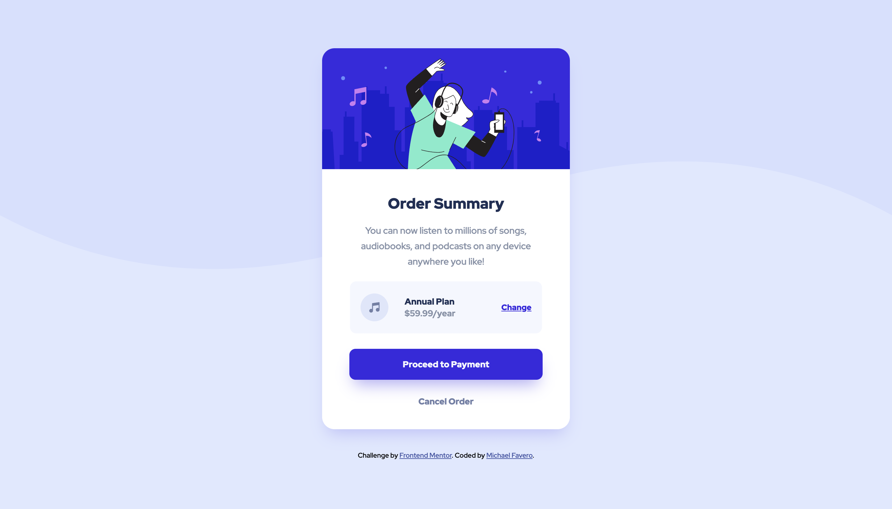

# Frontend Mentor - Order summary card solution

This is a solution to the [Order summary card challenge on Frontend Mentor](https://www.frontendmentor.io/challenges/order-summary-component-QlPmajDUj). Frontend Mentor challenges help you improve your coding skills by building realistic projects. 

## Table of contents

- [Overview](#overview)
  - [The challenge](#the-challenge)
  - [Screenshot](#screenshot)
  - [Links](#links)
  - [Built with](#built-with)
- [Author](#author)

**Note: Delete this note and update the table of contents based on what sections you keep.**

## Overview

### The challenge

Users should be able to:

- See hover states for interactive elements

### Screenshot

### Links

- Live Site URL: [Add live site URL here](https://faveromichael.github.io/Frontend-Mentor-Order-summary-component/)

### Built with

- [React](https://reactjs.org/) - JS library
- CSS custom properties
- CSS Flexbox
- Mobile-first workflow

## Author

- GitHub - [Michael Favero](https://github.com/faveromichael)
- Frontend Mentor - [@faveromichael](https://www.frontendmentor.io/profile/faveromichael)
- LinkedIN - [Michael Favero](https://www.linkedin.com/in/michael-favero-67849a195/)